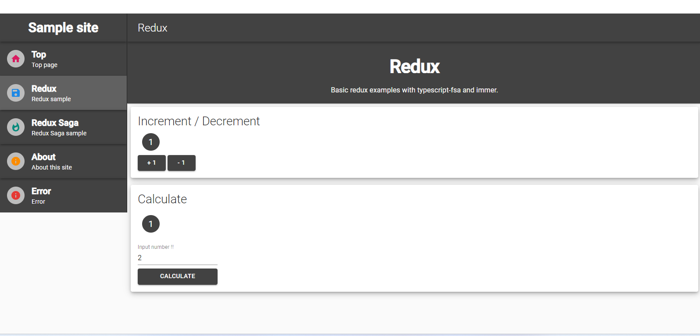
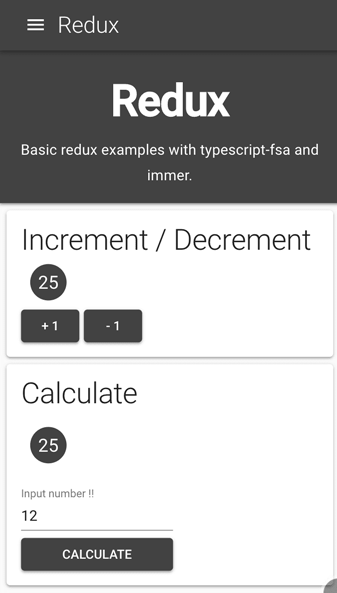

# Typescript-nextjs-redux-material-ui-demo

## Screenshot

### For desktop




### For mobile



## Features

- [Google App Engine Node.js Standard Environment](https://cloud.google.com/appengine/docs/standard/nodejs/)
- [Visual Studio Code](https://code.visualstudio.com/)
- [Typescript v3](https://www.typescriptlang.org/)
- [Next.js v9](https://nextjs.org/)
- [MATERIAL-UI v4](https://material-ui.com/)
- [Redux](https://redux.js.org/)
- [redux-saga](https://redux-saga.js.org/)
- [typescript-fsa](https://github.com/aikoven/typescript-fsa)
- [typescript-fsa-reducer](https://github.com/dphilipson/typescript-fsa-reducers)
- [ESLint](https://eslint.org/)

## Requirement

- [Google Chrome](https://www.google.com/intl/ja_ALL/chrome/)
- [Visual Studio Code](https://code.visualstudio.com/)
- TypeScript v3.7 or higher( [require Optional Chaining](https://www.typescriptlang.org/docs/handbook/release-notes/typescript-3-7.html#optional-chaining) )

## Install Google Chrome addon

- [Redux DevTools](https://chrome.google.com/webstore/detail/redux-devtools/lmhkpmbekcpmknklioeibfkpmmfibljd?hl=ja)

## Recommended VSCode addons

- [EditorConfig for VS Code](https://marketplace.visualstudio.com/items?itemName=EditorConfig.EditorConfig)
- [Prettier - Code formatter](https://marketplace.visualstudio.com/items?itemName=esbenp.prettier-vscode)
- [ESLint](https://marketplace.visualstudio.com/items?itemName=dbaeumer.vscode-eslint)
- [Bracket Pair Colorizer 2](https://marketplace.visualstudio.com/items?itemName=CoenraadS.bracket-pair-colorizer-2)

## Usage

### Download and install

First clone repository and then run following commands:
```bash

cd typescript-nextjs-redux-material-ui-demo
npm i
```

### Start local

```bash
npm run dev
```

### Build and start production express server

```bash
npm run build
npm start
```
